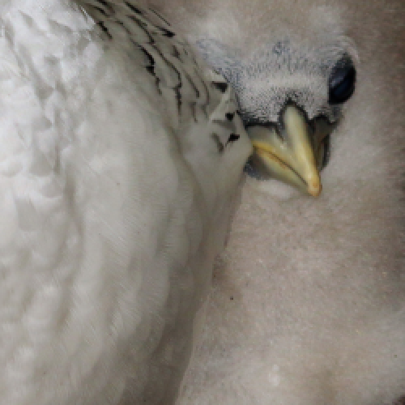
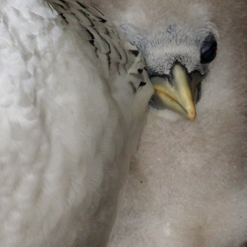
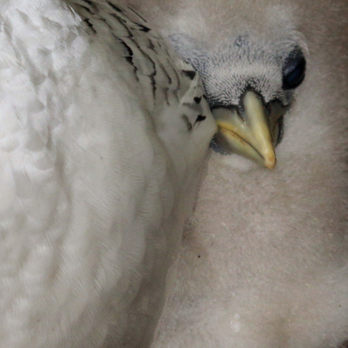

# SuperResolution
Course project for 13M054NM

PyTorch implementation of the Super-Resolution approach used in the researh paper [Residual Dense Network for Image Super-Resolution](https://arxiv.org/pdf/1802.08797.pdf)

Resulting images(input-output-target):

<!-- 

 -->

<!-- 

 -->
